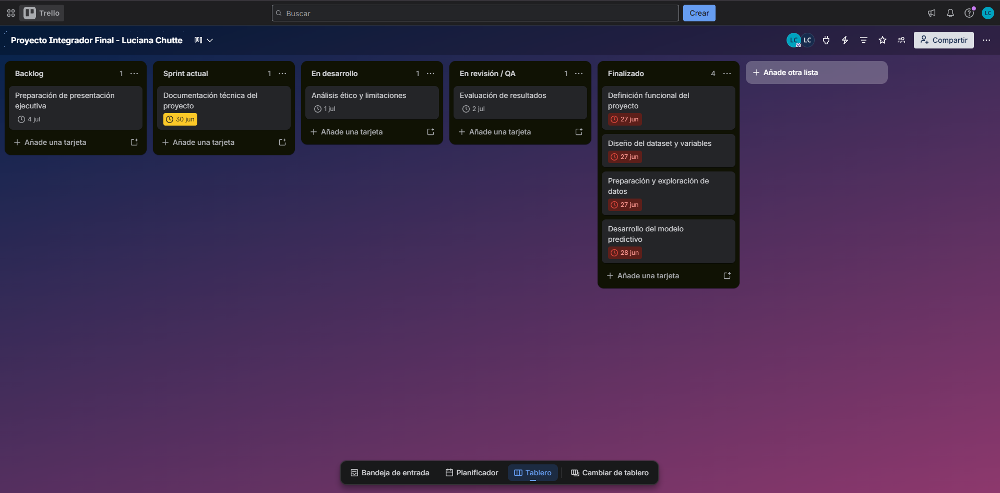

# Predicción de precios de viviendas

## Descripción del proyecto

Este proyecto fue desarrollado como parte del Proyecto Integrador Final de la materia Prácticas Profesionalizantes I, correspondiente a la Tecnicatura Superior en Ciencia de Datos e Inteligencia Artificial.

El trabajo simula un proyecto profesional de Ciencia de Datos aplicado a la predicción de precios de viviendas. Para ello, se generó un conjunto de datos sintético con características habitacionales y se entrenó un modelo de Machine Learning para estimar el precio aproximado de una propiedad.

El objetivo principal no es construir una herramienta real de tasación inmobiliaria, sino demostrar el proceso completo de trabajo en un proyecto de Ciencia de Datos: planificación, organización, generación de datos, análisis exploratorio, entrenamiento de un modelo, evaluación de resultados, documentación y comunicación profesional.

## Problema

La estimación del precio de una vivienda puede resultar compleja, ya que depende de múltiples factores como la superficie, la cantidad de habitaciones, la cantidad de baños, la antigüedad, la ubicación y la disponibilidad de cochera.

El problema abordado consiste en estimar el precio de una vivienda a partir de sus características principales, utilizando técnicas básicas de análisis de datos y Machine Learning.

## Objetivo general

Desarrollar un modelo predictivo que permita estimar el precio de una vivienda a partir de variables descriptivas de la propiedad.

## Objetivos específicos

* Generar un dataset sintético de viviendas.
* Realizar un análisis exploratorio de los datos.
* Preparar las variables para el entrenamiento del modelo.
* Entrenar un modelo de regresión.
* Evaluar el desempeño del modelo mediante métricas.
* Documentar el proceso de trabajo de forma clara y profesional.
* Simular la planificación y organización de un proyecto mediante herramientas colaborativas.

## Dataset

El dataset utilizado fue generado de forma sintética con fines académicos. Esto significa que los datos no pertenecen a viviendas reales, sino que fueron creados artificialmente para simular un caso de trabajo.

El dataset contiene registros simulados de viviendas y las siguientes variables:

* `superficie_m2`: superficie de la vivienda en metros cuadrados.
* `habitaciones`: cantidad de habitaciones.
* `banios`: cantidad de baños.
* `antiguedad`: antigüedad de la vivienda en años.
* `cochera`: indica si la vivienda posee cochera.
* `precio`: precio estimado de la vivienda.

## Metodología

El proyecto se desarrolló siguiendo las siguientes etapas:

1. Definición del problema.
2. Planificación del proyecto mediante Trello.
3. Asignación de roles simulados.
4. Generación del dataset sintético.
5. Análisis exploratorio de datos.
6. Preparación de variables.
7. Entrenamiento de un modelo de Regresión Lineal.
8. Evaluación del modelo.
9. Documentación en GitHub.
10. Análisis ético y presentación de resultados.

## Roles simulados del proyecto

Si bien el proyecto fue desarrollado de forma individual, se simularon roles típicos de un equipo de Ciencia de Datos para representar un contexto profesional de trabajo.

| Rol               | Responsabilidades asumidas                                                                         |
| ----------------- | -------------------------------------------------------------------------------------------------- |
| Líder de proyecto | Definición del alcance, organización de tareas, priorización del backlog y seguimiento del avance. |
| Data Engineer     | Generación del dataset sintético, preparación de datos y revisión de estructura.                   |
| Data Scientist    | Desarrollo del modelo predictivo, entrenamiento y evaluación mediante métricas.                    |
| Data Analyst      | Análisis exploratorio, interpretación de resultados y generación de conclusiones.                  |
| Documentador / QA | Redacción del README, informe ético, revisión de entregables y control de calidad del proyecto.    |

## Sprint Planning

Para la planificación del proyecto se utilizó una dinámica ágil basada en un sprint corto de trabajo. Durante el Sprint Planning se priorizaron las tareas necesarias para construir una primera versión funcional del proyecto.

### Objetivo del sprint

Construir una solución inicial capaz de generar un dataset sintético de viviendas, realizar un análisis exploratorio, entrenar un modelo predictivo, evaluar sus resultados y documentar el proceso.

### Duración estimada

6 días.

### Tareas priorizadas

| Tarea                                 | Estado           |
| ------------------------------------- | ---------------- |
| Definición funcional del proyecto     | Finalizado       |
| Diseño del dataset y variables        | Finalizado       |
| Preparación y exploración de datos    | Finalizado       |
| Desarrollo del modelo predictivo      | Finalizado       |
| Evaluación de resultados              | En revisión / QA |
| Análisis ético y limitaciones         | En desarrollo    |
| Documentación técnica del proyecto    | Sprint actual    |
| Preparación de presentación ejecutiva | Backlog          |

### Criterio de finalización

El sprint se considera finalizado cuando el proyecto cuenta con:

* Notebook funcional.
* Dataset generado.
* Resultados evaluados.
* Documentación en GitHub.
* Informe ético.
* Presentación final preparada.

## Planificación y seguimiento en Trello

Para la gestión del proyecto se utilizó Trello como herramienta de planificación visual. El tablero fue organizado bajo una estructura tipo Kanban, permitiendo visualizar el estado de cada etapa del proyecto.

Las columnas utilizadas fueron:

* Backlog
* Sprint actual
* En desarrollo
* En revisión / QA
* Finalizado

Esta organización permitió representar el flujo de trabajo desde la definición inicial del proyecto hasta la documentación y preparación de la presentación final.

### Link al tablero

[Ver tablero de Trello](https://trello.com/invite/b/6a42ea5afb5f2fdf5f7d6a0a/ATTI75e0cc3bd286f0fb7c05a812b1e8224784EEAA6F/proyecto-integrador-final-luciana-chutte)

### Captura del tablero



## Modelo utilizado

Se utilizó un modelo de Regresión Lineal, ya que permite predecir una variable numérica continua, en este caso el precio de una vivienda.

Este modelo fue elegido por ser simple, interpretable y adecuado para un proyecto académico inicial de predicción de valores numéricos.

## Métricas de evaluación

Para evaluar el desempeño del modelo se utilizaron las siguientes métricas:

* MAE: Error Absoluto Medio.
* R²: Coeficiente de determinación.

## Herramientas utilizadas

* Python
* Pandas
* NumPy
* Matplotlib
* Scikit-learn
* Trello
* GitHub
* Google Colab
* Gamma

## Gestión del proyecto

La gestión del proyecto se realizó mediante Trello y GitHub.

Trello fue utilizado para organizar las etapas del proyecto, visualizar el avance y simular una dinámica de trabajo ágil.

GitHub fue utilizado como repositorio central del proyecto, permitiendo almacenar el notebook, el dataset, la documentación, el informe ético y los archivos asociados.

## Estructura del repositorio

```text
proyecto-prediccion-precios-vivienda/
│
├── data/
│   └── viviendas_simuladas.csv
│
├── docs/
│   ├── informe_etica.md
│   └── Trello.png
│
├── notebooks/
│   └── prediccion_precios_vivienda.ipynb
│
├── outputs/
│
├── README.md
└── requirements.txt
```

## Resultados obtenidos

El modelo de Regresión Lineal obtuvo los siguientes resultados:

* MAE: 12.888,78
* R²: 0.9484

El MAE indica que el modelo presenta un error promedio aproximado de 12.889 unidades monetarias entre el precio real simulado y el precio predicho.

El valor de R² indica que el modelo explica aproximadamente el 94,84% de la variación del precio de las viviendas dentro del dataset sintético utilizado.

Estos resultados son coherentes con el tipo de datos generados, ya que el dataset fue construido artificialmente con relaciones claras entre las variables y el precio. Por este motivo, el modelo muestra un buen desempeño en el contexto académico del proyecto.

## Limitaciones

* Los datos utilizados son simulados.
* El modelo no contempla variables económicas reales.
* No se consideran factores externos como inflación, demanda del mercado, cercanía a servicios o estado real de la propiedad.
* El modelo no reemplaza una tasación inmobiliaria profesional.
* El proyecto fue desarrollado con fines educativos.

## Consideraciones éticas

El proyecto utiliza datos sintéticos, por lo que no se trabajó con datos personales, sensibles ni pertenecientes a personas reales.

En un contexto real, un modelo de predicción de precios de viviendas debería analizarse con cuidado, ya que podría influir en decisiones económicas importantes. También sería necesario evaluar posibles sesgos vinculados a la ubicación, nivel socioeconómico, acceso a servicios u otras características del entorno.

Por este motivo, las predicciones deben interpretarse como una herramienta de apoyo y no como una única fuente de decisión.

## Conclusión

El proyecto permitió simular el desarrollo de una solución de Ciencia de Datos en un contexto profesional. A través del proceso se aplicaron etapas de planificación, preparación de datos, análisis exploratorio, modelado, evaluación, documentación y comunicación de resultados.

Además, se utilizaron herramientas colaborativas como Trello y GitHub, fortaleciendo habilidades técnicas y profesionales necesarias para participar en proyectos reales del ámbito tecnológico.

Como aprendizaje principal, el proyecto permitió comprender cómo se organiza un flujo de trabajo completo en Ciencia de Datos, desde la definición del problema hasta la presentación final de resultados.
